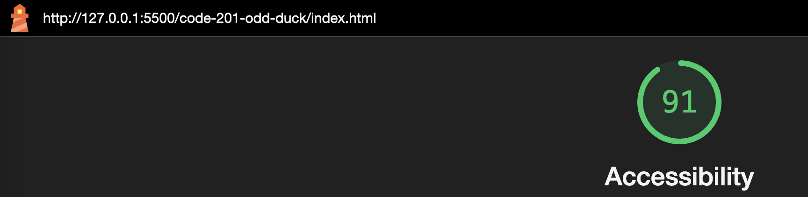

# LAB - 11

## Odd Duck

I build a web application with the purpose of displaying three potential products side-by-side, which are combined at random. The user can vote for 1 of the 3 products displayed that they think should be the next new product.

The app calculates the vote totals and number of views each product receives, and caps the number of votes at 25.

### Author: Rhett Chase

### Links and Resources

- [submission PR](https://github.com/rhettchase/code-201-odd-duck)
- [web.dev FlexBox](https://web.dev/learn/css/flexbox/)
- [MDN - Arrays](https://developer.mozilla.org/en-US/docs/Web/JavaScript/Reference/Global_Objects/Array/pop)
- ChatGPT

### Lighthouse Accessibility Report Score

### Reflections and Comments

- I used a constructor function that creates an object associated with each product
- I developed an algorithm that randomly generates three unique product images from the directory and displays them side by side
- I used `.slice()` to generate a copy of the product array without changing the original
- To enable the random generation and ensure that all the products would be viewed on the list but then not recycled, I used `.pop()`
- `EventListeners` were utilized to track the number of votes and invoke different functions with each click
- I used `document.querySelector` to select the appropriate elements from the html file to link it the javascript variables
